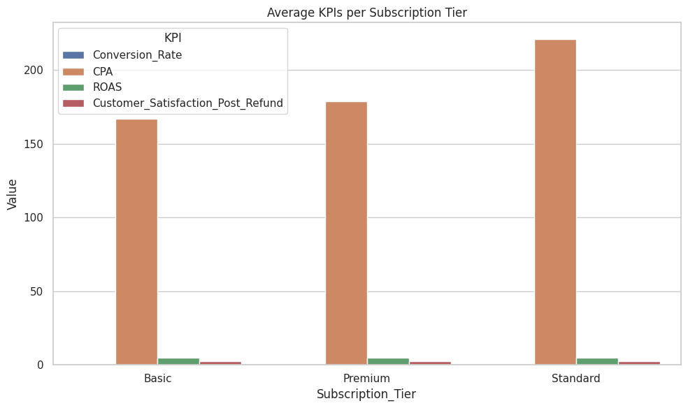

# Marketing Campaign Performance Analysis

## 📊 Project Overview

This project analyzes marketing and product campaign data to uncover actionable insights that drive performance improvements. It uses BigQuery for SQL-based exploration and Python (Pandas, Matplotlib, Seaborn) for data cleaning and visualization. The main objective is to identify how different attributes like discount levels, product categories, and customer segments influence key metrics such as ROAS, CPA, and Conversion Rate.

---

## 🧮 Dataset Description

The dataset includes information about 10,000 marketing campaigns across different subscription tiers, product features, keywords, customer satisfaction ratings, and performance indicators such as:

- Conversion Rate
- Cost per Acquisition (CPA)
- Return on Ad Spend (ROAS)
- Revenue per Unit
- Discount Level
- Customer Satisfaction

---

## 🛠️ Technologies Used

- **Google BigQuery** for data storage and SQL analysis
- **Python** (Pandas, Seaborn, Matplotlib) for data cleaning and visualization
- **Google Colab** as the coding environment
- **Markdown + GitHub** for documentation and portfolio presentation

---

## 🔍 SQL Analysis & Insights

### 1. KPIs per Subscription Tier
```sql
SELECT Subscription_Tier, COUNT(*) AS Total_Campaigns,
       ROUND(AVG(Conversion_Rate), 2) AS Avg_Conversion_Rate,
       ROUND(AVG(CPA), 2) AS Avg_CPA,
       ROUND(AVG(ROAS), 2) AS Avg_ROAS,
       ROUND(AVG(Customer_Satisfaction), 2) AS Avg_Satisfaction
FROM marketing_kpis
GROUP BY Subscription_Tier
ORDER BY Total_Campaigns DESC;
```
- **Insight**: The Basic tier had slightly better ROAS and conversion performance, while Premium had lower CPA but slightly lower satisfaction.



### 2. Keyword Impact on Campaign KPIs
```sql
SELECT Common_Keywords, COUNT(*) AS Total_Campaigns,
       ROUND(AVG(Conversion_Rate), 2) AS Avg_Conversion_Rate,
       ROUND(AVG(CPA), 2) AS Avg_CPA,
       ROUND(AVG(ROAS), 2) AS Avg_ROAS,
       ROUND(AVG(Customer_Satisfaction), 2) AS Avg_Satisfaction
FROM marketing_kpis
GROUP BY Common_Keywords
ORDER BY Total_Campaigns DESC;
```
- **Insight**: “Affordable” and “Stylish” campaigns yielded better conversion rates, although at a higher CPA.


### 3. Campaign Distribution by Discount Level
```sql
SELECT Discount_Category, COUNT(*) AS Total_Campaigns,
       ROUND(AVG(CPA), 2) AS Avg_CPA,
       ROUND(AVG(ROAS), 2) AS Avg_ROAS,
       ROUND(AVG(Customer_Satisfaction), 2) AS Avg_Satisfaction
FROM marketing_kpis
GROUP BY Discount_Category
ORDER BY Total_Campaigns DESC;
```
- **Insight**: High discounts (40-59%) maintained strong performance metrics and satisfaction scores, proving to be a sweet spot for campaign design.


### 4. Perfect Campaigns (High ROAS & High Satisfaction)
```sql
SELECT COUNT(*) AS Perfect_Campaigns
FROM marketing_kpis
WHERE ROAS > 6 AND Customer_Satisfaction > 2.5;
```
- **Insight**: Only a small subset (~5%) of campaigns achieved both high profitability and customer satisfaction, highlighting a significant optimization opportunity.


### 5. Revenue Distribution
```sql
SELECT Revenue_per_Unit
FROM marketing_kpis;
```
- **Insight**: Revenue was highly skewed with a long tail — a few campaigns generated extremely high revenue while most were moderate.


---

## 🧹 Python Data Cleaning

We used `pandas` to:

- Handle missing values in `Customer_Satisfaction`
- Normalize `ROAS` and `CPA` for outlier removal
- Calculate additional derived metrics like `Revenue_per_Unit` and `ROAS_Buckets`

---

## 📈 Python Visualizations & Findings

### ROAS Distribution by Satisfaction Level


- Campaigns with higher satisfaction generally showed better ROAS.

### CPA vs ROAS


- There’s a clear inverse relationship: higher CPA tends to reduce ROAS.

---

## 🧠 Key Business Insights

- Moderate discount campaigns (20–40%) show optimal performance and customer satisfaction.
- CPA is a strong inverse predictor of ROAS.
- Subscription tier and keyword combinations yield distinct performance profiles.
- Only ~10% of campaigns were unprofitable — with targeted strategy adjustments, performance could be significantly enhanced.

---

## 📁 Folder Structure

```
marketing-campaign-performance/
├── images/
│   ├── average_kpis_per_subscription_tier.png
│   ├── correlation_matrix_marketing_product_kpis.png
│   ├── discount_level_vs_conversion_rate.png
│   ├── highlight_perfect_campaigns.png
│   ├── revenue_generated_distribution.png
│   ├── roas_distribution_by_customer_satisfaction.png
│   └── roas_vs_cpa.png
├── Marketing_Campaign_Performance_Analysis.ipynb
├── marketing_campaign_performance_analysis (SQL queries)
├── README.md
```

---

## 👤 Author

Christos Papakostas  
[LinkedIn](https://www.linkedin.com/in/christos-papakostas/) • [GitHub](https://github.com/xrpapak)

